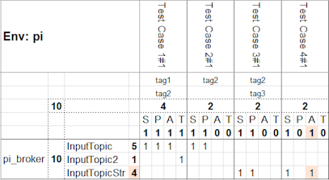
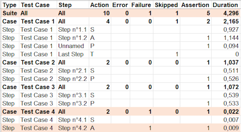

# ktest - Kafka testing utility

Utility for defining and executing Kafka message test cases by 
- sending sets of messages *(step action: SEND)* to topics or 
- checking for the presence *(step action: PRESENT)* or absence *(step action: ABSENT)* of messages in topics or
- disabling in progress messages *(step action: TODO)*.

The content of the tested messages can be parameterized by script:
- generally for an environment *(`onStart` and `onEnd` tags in the configuration)*
- globally for a test case (`beforeAll` and `afterAll` tags in the test cases)
- for a particular step (`before` and `after` tags of the step)
- at the level of a message attribute (by including a marker `${...}`)

Test case sets can be executed sequentially or in parallel, and a JUnit-format report is produced at the end of execution.

This utility is compiled by default for Linux *(or WSL2 under Windows)* and supports messages using Avro.

### Basic usage and list of available commands
```
Usage: ktest [-hV] [COMMAND]
Kafka testing utility.
  -h, --help      Show this help message and exit.
  -V, --version   Print version information and exit.
Commands:
  srun  Sequential run of test case(s).
  prun  Parallel run of test case(s).
  doc   Display full documentation.
  eval  Evaluates a script and displays its final result.
```

### Sequential run command arguments: `srun`
**Usage:** `ktest srun [-hV] [-b=<backOffset>] [-c=<config>] -e=<env> [-f=<file>] [-m=<matrix>] [-r=<report>] [-t=<tags>]`

**Options:**
```
-b, --back=<backOffset>   Back offset.
                            Default: 250
-c, --config=<config>     Path of the config file.
                            Default: ktconfig.yml
-e, --env=<env>           Name of the environment to use.
-f, --file=<file>         Path of test case description file to execute.
                            Default: ktestcase.yml
-h, --help                Show this help message and exit.
-m, --matrix=<matrix>     Path of the matrix summary file (xlsx format).
                            Default: ktmatrix.xlsx
-r, --report=<report>     Path of the test report file (JUnit format).
                            Default: ktreport.
-t, --tags=<tags>         Tags to filter test cases to run.
-V, --version             Print version information and exit.
```

**Exit status:**
- 0      if all test succeeded,
- 1      if at least one test failed or there was an exception.

### Parallel run command arguments: `prun`
**Usage:** `ktest prun [-hV] [-b=<backOffset>] [-c=<config>] -e=<env> [-f=<file>] [-m=<matrix>] [-r=<report>] [-t=<tags>]`

**Options:** accepts the same options as the `srun` command.

**Exit status:** same as `srun` command.

### Display of the full documentation command arguments: `doc`
**Usage:** `ktest doc [-hV]`

**Options:**
```
-h, --help      Show this help message and exit.
-V, --version   Print version information and exit.
```

### Evaluation of a script command arguments: `eval`
**Usage:** `Usage: ktest eval [-hV] -l=<line>`

**Options:**
```
I   -h, --help          Show this help message and exit.
I   -l, --line=<line>   In-line statements to evaluate.
I   -V, --version       Print version information and exit.
```

### Configuration file
Yaml configuration file called by default `ktconfig.yml` in the same directory as the executable.

**Example:**
```yaml
registries:
  - name: pi_registry
    url: http://192.168.0.105:8081
    user: UserName
    password: UserPassword
  - name: registry_2
    ...
brokers:
  - name: pi_broker
    bootstrap.servers: 192.168.0.105:9092
    registry: pi_registry
    sasl.jaas.config: org.apache.kafka.common.security.plain.PlainLoginModule required username='USER' password='${env(\"PASSWORD\")}';
    sasl.mechanism: PLAIN
    security.protocol: SASL_SSL
    group.id: pi.ktest-group
  - name: local_broker
    ...
environments:
  - name: pi
    onStart: |
      BROKER_USED="pi_broker"
      ...
    onEnd: info("Test finished")
  - name: dev
    ...
```

### Test Case file
The test cases are described using yaml files, following the format:
```yaml
name: "Name of the Test Case"
tags: [ DEV, ... ]
beforeAll: |
  TIMESTAMP = now()
  ...
steps:
  - name: "Name of Step 1"
    before: RANDOM_UUID = uuid()
    broker: ktconfig_broker_name
    topic: DestinationTopicName
    keySerde: STRING
    valueSerde: AVRO
    action: SEND
    record:
      headers:
        headAttribute1: "Sample record header value"
        ...
      key: |
        code: ${concat("UUID=", RANDOM_UUID)}
        label: Product 1
      value: |
        attribute1: SingleWord
        attribute2: 2.0
        ...
    after: pause(100)
  - name: "Name of Step 2"
    ...
afterAll: info("All steps are finished.")
---
name: NameOfSecondTestCase
...
```

##### Available operators and scripting functions
Use the `doc` command to have the guarantee of an up-to-date list.
```
Operators/Tokens:
  -      -3       -3     Unary minus operator: negates the number value.
  +      4+3       7     Addition operator: adds to numbers.
  -      9-5       4     Subtraction operator; subtracts second number from first number.
  *      2*3       6     Multiplication operator: multiplies two numbers.
  /      5/2      2.5    Division operator: divides first number by second number.
  =     A=3.14           Assignment operator.
  (    3*(1+2)     9     Left brace: start increased priority.
  )     -(-4)      4     Right brace: ends increased priority.
```
```
Conditions/Tokens:
  ?    cnd?stm           Execute a statement only if condition is true (=1).
  ==   "A"=="A"    1     Equal: true if arguments are equals.
  !=     5!=5      0     Not Equal: true if arguments are differents.
  <=    2<=1+1     1     Lesser or Equal: true if left argument is smaller or equal to right argument.
  <      2<2       0     Lesser: true if left argument is strictly smaller than right argument.
  >=     0>=1      0     Greater or Equal: true if left argument is greater or equal to right argument.
  >      3>2       1     Greater: true if left argument is strictly greater than right argument.
```
```
Specials/Tokens:
  ;                      Ends the current in-line statement an starts a new one.
```
```
Scripting Functions:
 CRYPT:
  aesdec  ("B64CryptedIn", "B64Key")             "ClearText"                            Returns the decrypted value of base64-AES256 encrypted value.
  aesenc  ("ClearText", "B64Key")                "B64CryptedOut"                        Returns the base64 form of the value encrypted with AES256.
  aeskey  ()                                     "ygrS4...ijP8="                        Returns a new random base-64-encoded AES256 key.
 FAKER:
  regexgen("E-[A-Z]{2,4}#{2}")                   "E-AJD##"                              Returns a new random string matching provided regex.
  uuid    ()                                     "fd48147a-58ba-461b-b71c-f44c89ba67ca" Returns a new random UUID.
 HASH:
  crc32   ("SampleString")                       "3ca8bf4"                              Returns the CRC-32 hash of the string parameter.
  decode64("VGV4dA==")                           "Text"                                 Returns the decoded text of a base64 encoding string.
  encode64("SampleString")                       "U2FtcGxlU3RyaW5n"                     Returns the base64 encoding of a string.
  md5     ("SampleString")                       "ec1dd92925cb06934c047fb3f5380cba"     Returns the MD5 hash of the string parameter.
  sha1    ("SampleString")                       "ac7fc7261c573830...f20bf0d74d1443cd"  Returns the SHA-1 hash of the string parameter.
  sha256  ("SampleString")                       "77b12c9c6213a05f...8b2c34769ec4fc20"  Returns the SHA-256 hash of the string parameter.
  sha512  ("SampleString")                       "aee8e20df4b3ce73...e7e03c6fcda75961"  Returns the SHA-512 hash of the string parameter.
 HEX:
  hex2int ("7fff")                               32767                                  Returns the integer value of an hexadecimal string.
  int2hex (32767)                                "7fff"                                 Returns the hexadecimal representation of number.
 LOG:
  debug   (2+3)                                  5                                      Logs the concatenation of evaluated expression(s) as DEBUG output.
  error   ("Failed")                             Failed                                 Logs the concatenation of evaluated expression(s) as ERROR output.
  info    ("r=", 2*3)                            r=6                                    Logs the concatenation of evaluated expression(s) as INFO output.
  trace   ("A", "b")                             Ab                                     Logs the concatenation of evaluated expression(s) as TRACE output.
  warn    ()                                                                            Logs the concatenation of evaluated expression(s) as WARN output.
 MATH:
  abs     (-3.14)                                3.14                                   Returns the absolute value of a number.
  ceil    (3.14)                                 4                                      Returns the least integer value >= to given number.
  floor   (3.14)                                 3                                      Returns the greatest integer value <= to given number.
  max     (5, -2)                                5                                      Returns the maximal value of 1 or more numbers.
  min     (5, -2, 0)                             -2                                     Returns the minimal value of 1 or more numbers.
  pow     (2, 8)                                 256                                    Returns the value of the 1st number raised to the power of the 2nd.
  round   (2.43)                                 2                                      Returns the nearest integer, rounding half away from zero.
  sgn     (-9.63)                                -1                                     Returns the sign of the number (-1, 0 or 1).
  sqr     (2)                                    1.4142135623730951                     Returns the square root of the number.
 MISC:
  env     ("SHELL")                              "/bin/bash"                            Returns the value of an ENV variable.
  goto    ("NameOfStep")                                                                Jump and continue to named Step.
  pause   (3000)                                                                        Pause treatment during provided milliseconds.
 TEXT:
  concat  ("Aaa", "Bbb",...)                     "AaaBbb"                               Returns the concatenation of multiple strings.
  left    ("Sample", 3)                          "Sam"                                  Returns the x first characters of a string.
  length  ("Short text")                         10                                     Returns the length of a string.
  lower   ("ToLower")                            "tolower"                              Returns the lower cased string.
  ltrim   (" Test ")                             "Test "                                Returns the string with all left spaces removed.
  replace ("ABAB", "B", "a")                     "AaAa"                                 Returns a new string with old substring replaced by new substring.
  right   ("Sample", 3)                          "ple"                                  Returns the x last characters of a string.
  rtrim   (" Test ")                             " Test"                                Returns the string with all right spaces removed.
  upper   ("ToUpper")                            "TOUPPER"                              Returns the upper cased string.
 TIME:
  now     ()                                     1708808432990                          Returns the current time in millis.
  time2txt("yyyy-MM-dd HH:mm:ss", 1708854821321) "2024-02-25 10:53:41"                  Returns the formatted date/string of a timestamp at current TimeZone.
  txt2time("yyyy/MM/dd", "2024/07/17")           1721174400000                          Returns the timestamp of a formatted date string.
```

### License: [Apache License Version 2.0](LICENSE)

### FAQ
##### The tested process does not have time to produce events before the presence check.
For example, you can group all the `action: SEND` steps and then use a `before: pause(x)` script in the definition of the first `action: PRESENT` step, to give the process time to execute.

##### How can we ensure there will be no poison pill?
In the absence of specific instructions, ktest attempts to retrieve a potential schema for the keys/values: if found, the schema is used, otherwise, serialization defaults to String.

In case of registry availability issues, a string message could be mistakenly sent to a topic expecting a schema.

This problem can be resolved by enforcing a type with the options `keySerde: STRING or AVRO` and/or `valueSerde: STRING or AVRO` in the step definitions.

##### What are the scopes of script variables?
- `onStart` / `onEnd` of environments _(configuration file)_: visible in all test cases & steps.
- `beforeAll` / `afterAll` of test cases: visible in all steps of the test case.
- `before` / `after`: limited to the step where they are declared.

##### How to avoid putting passwords in plain text in the config?
You can use the `eval` command to run a script to obtain an AES key and encrypt your password or your jaas.config string.

For example: 
```bash
ktest eval -l="key = aeskey(); info(\"Key: \", key); encrypted = aesenc(\"Clear Password\", key); info(\"Encrypted: \", encrypted)"
```

And then add the key in your secure environment and use the AES 256 decoding feature in the broker configs of the `ktconfig.yml` file.

For example:
```yaml
    ...
brokers:
  - name: pi_broker
    bootstrap.servers: 192.168.0.105:9092
    sasl.jaas.config: ${aesdec("/UzY8ua+9iuKhhAWNslS...zTWpVktEhBHBIo3oKw==", env("LOCAL_ENV_KEY"))}
    ...
```

##### How to change log level?
Add `-Dktest.log.level=<LEVEL>` to command line, using `TRACE`, `DEBUG`, `INFO` *(default)*, `WARN` or `ERROR` as level.

##### How to iterate on sending events or run a load test?
You can define as many test case-level counter variables and use them in combination with step-level conditioned `goto` orders to iterate.
For example:
```yaml
name: Goto Test Case
beforeAll: |
  LOOP_COUNT = 10
steps:
  - name: Send 10 events
    ...
    action: SEND
    record:
      key: "Loop-${LOOP_COUNT}"
      value: |
        ...
    after: |
      LOOP_COUNT = LOOP_COUNT - 1
      LOOP_COUNT!=0 ? goto("Send 10 events")
  - name: Verify result
    ...
```

##### How to run only a subset of the test cases?
You can tag the different test case definitions and then use the `-t` or `--tags` option to filter the test cases.

For example:
* `ktest prun ... -t t1` to run only test cases having the "t1" tag,
* `ktest srun ... --tags "t1+t2"` to run only test cases having the "t1" AND the "t2" tags,
* `ktest srun ... -t "t1,t2+t3"` to run only test cases having the "t1" OR ("t2" AND "t3") tags.
* `ktest prun ... -t "t1,t2+t3,!t4"` to run only test cases having ("t1" OR ("t2" AND "t3") tags) but no "t4" tag.

##### How to get an overview of a set of executed test cases?
The execution generates a report called 'ktmatrix.xlsx', which contains a matrix representing the actions of the test cases in relation to all the topics, highlighting any potential failures.

For example:

 