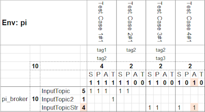
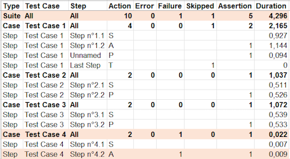

# Advanced Topics

## FAQ

### The tested process does not have time to produce events before the presence check.

For example, you can group all the `action: SEND` steps and then use a `before: pause(x)` script in the definition of the first `action: PRESENT` step, to give the process time to execute.

### How can we ensure there will be no poison pill?

In the absence of specific instructions, ktest attempts to retrieve a potential schema for the keys/values: if found, the schema is used, otherwise, serialization defaults to String.

This problem can be resolved by enforcing a type with the options `keySerde: STRING or AVRO` and/or `valueSerde: STRING or AVRO` in the step definitions.

### What are the scopes of script variables?

- `onStart` / `onEnd` of environments *(configuration file)*: visible in all test cases & steps.
- `beforeAll` / `afterAll` of test cases: visible in all steps of the test case.
- `before` / `after`: limited to the step where they are declared.

### How to avoid putting passwords in plain text in the config?

You can use the `eval` command to run a script to obtain an AES key and encrypt your password or your jaas.config string.

For example:
```bash
ktest eval -l="key = aeskey(); info(\"Key: \", key); encrypted = aesenc(\"Clear Password\", key); info(\"Encrypted: \", encrypted)"
```

And then add the key in your secure environment and use the AES 256 decoding feature in the broker configs of the `ktconfig.yml` file.

For example:
```yaml
...
brokers:
  - name: pi_broker
    bootstrap.servers: 192.168.0.105:9092
    sasl.jaas.config: ${aesdec("/UzY8ua+9iuKhhAWNslS...zTWpVktEhBHBIo3oKw==", env("LOCAL_ENV_KEY"))}
    ...
```

### How to change log level?

Add `-Dktest.log.level=<LEVEL>` to command line, using `TRACE`, `DEBUG`, `INFO` *(default)*, `WARN` or `ERROR` as level.

### How to iterate on sending events or run a load test?

You can define as many test case-level counter variables and use them in combination with step-level conditioned `goto` orders to iterate.

For example:
```yaml
name: Goto Test Case
beforeAll: |
  LOOP_COUNT = 10
steps:
  - name: Send 10 events
    ...
    action: SEND
    record:
      key: "Loop-${LOOP_COUNT}"
      value: |
        ...
    after: |
      LOOP_COUNT = LOOP_COUNT - 1
      LOOP_COUNT!=0 ? goto("Send 10 events")
  - name: Verify result
    ...
```

### How to run only a subset of the test cases?

You can tag the different test case definitions and then use the `-t` or `--tags` option to filter the test cases.

For example:
- `ktest prun ... -t t1` to run only test cases having the "t1" tag,
- `ktest srun ... --tags "t1+t2"` to run only test cases having the "t1" AND the "t2" tags,
- `ktest srun ... -t "t1,t2+t3"` to run only test cases having the "t1" OR ("t2" AND "t3") tags.
- `ktest prun ... -t "t1,t2+t3,!t4"` to run only test cases having ("t1" OR ("t2" AND "t3") tags) but no "t4" tag.

### How to get an overview of a set of executed test cases?

The execution generates a report called `ktmatrix.xlsx`, which contains a matrix representing the actions of the test cases in relation to all the topics, highlighting any potential failures.

For example:

 

### How to preset some options based on the environment?

Environment definitions accept an `options` attribute to predefine the values of `autoPause`, `backOffset`, `matrix`, `report` and/or `tags`.

These values then apply when selecting the environment unless other values are forced on the command line.

### How to test a topic not using the default TopicNameStrategy for schema naming?

The names of the target schemas can be forced with the `keySchema` and `valueSchema` attributes.

For example:
```yaml
name: Custom Subject Naming Strategy
steps:
  - name: Forced Value Schema
    ...
    valueSerde: AVRO
    valueSchema: forced-schema-name
    record:
    ...